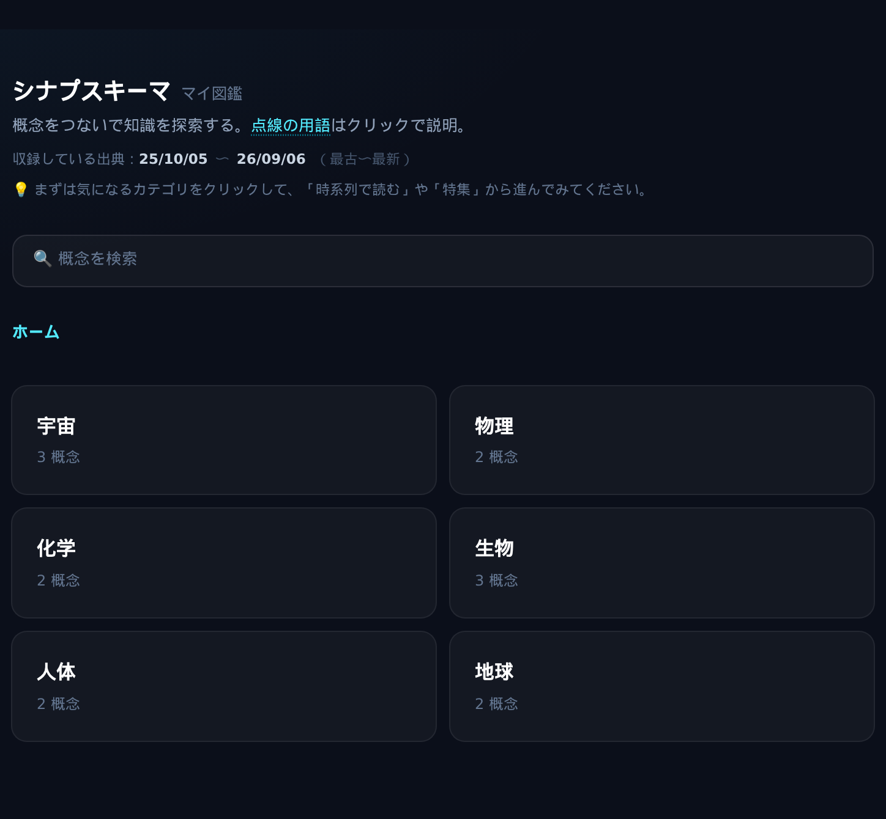
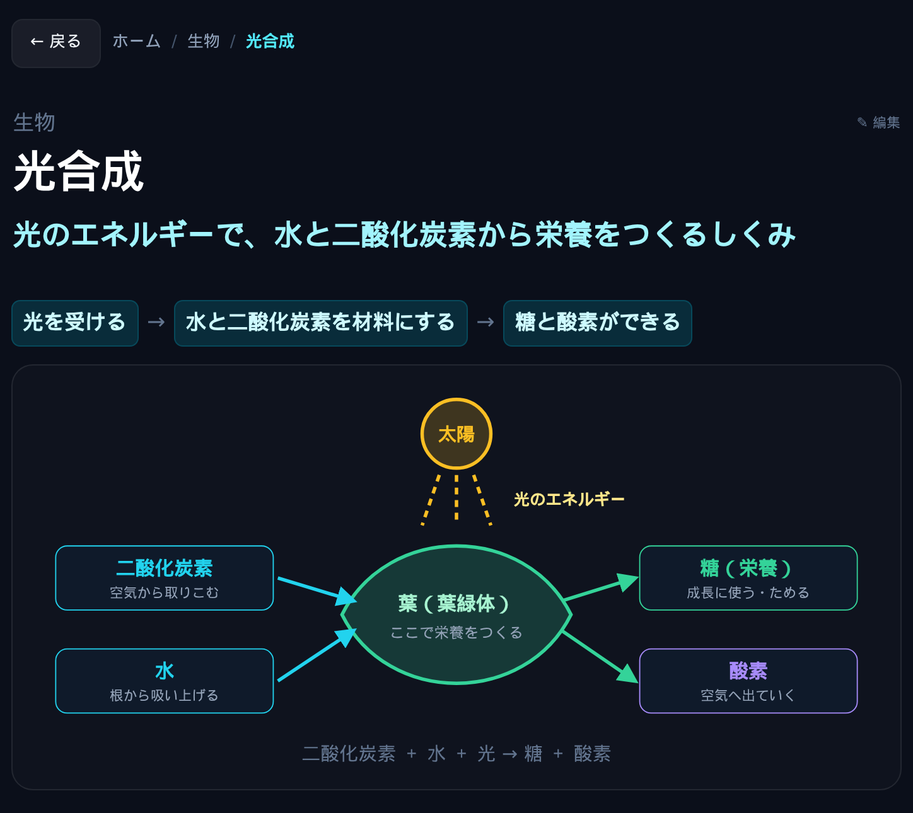

# シナプスキーマ（MulmoClaude 用スキル）

知識を **概念ごとのカード** に分けて積み上げ、図解とつながりでたどれる図鑑に育てるスキルです。
AIアシスタント [MulmoClaude](https://github.com/receptron/mulmoclaude) の上で動きます。

テーマや素材は選びません。読んだ本や記事、講義や動画のメモ、ウェブページを取り込んでも、「〇〇の図鑑を作って」とテーマだけ伝えても使えます。

> 定期配信のメルマガ向けに「どの号の話か」を付ける版（[メルマガ知識図鑑](https://github.com/otakauth/merumaga-zukan-kit)）は、別のリポジトリに置いてあります。



※画面は見本です。実際には、ここに取り込んだ内容が入ります。

## できること

- **1つの話題が、1枚のカードになる** — 同じ話題が別の素材に出てきても、カードは1枚にまとまります。
- **図解で、ひと目でつかめる** — カードごとに、AIが話題に合った図を描きます。
- **何から得た話かが、分かる** — カードの中の説明1つずつに、出典の日付が付きます。
- **関連する概念へ、たどっていける** — カードの下に関係のある概念が並び、押すとそのカードへ移れます。
- **スマホでも読める**



※画面は見本です。実際には、ここに取り込んだ内容が入ります。

## 中に入っているもの

```text
mulmoclaude/synapschema/
  SKILL.md            手順書（素材の読み方と、カードへの分け方を MulmoClaude に伝えるもの）
  schema.json         カードの型（カードにどんな項目を持たせるか）
  views/map.html      パソコン用の画面（図鑑の見た目と図解の描き方）
  views/map-mobile.html  スマホ用の画面
  tools/mkmobile.cjs  パソコン用の画面からスマホ用を作り直す道具
  samples/            見本のカード 14枚（宇宙・物理・化学・生物・人体・地球）
  LICENSE             ライセンス（MIT-0）
```

## 使い方

1. MulmoClaude を用意する
2. このページの URL をコピーして MulmoClaude のチャットに貼り、「このシナプスキーマを入れて」と伝える
3. どんなテーマの図鑑にするかを聞かれたら、答える（分類がテーマに合わせて作り直されます）
4. 素材を貼り付けて「取り込んで」と伝えるか、「〇〇の図鑑を作って」と伝える
5. 図鑑の画面を開くと、カードや図解、つながりができている

見本のカードが要らなくなったら、「見本を消して」と伝えるだけで片づきます。

## 知っておいてほしいこと

- カードはAIがまとめたものなので、まちがいが入ることがあります。学習や判断に使うときは、元の資料で確かめると安心です。
- 有料の素材や公開されていない素材から作った図鑑は、ご自身の手元で使うためのものとして考えています。公開する前には、素材の決まりを確かめるのがおすすめです。
- 見本カードの日付は、見せ方を伝えるための架空のものです。

## ライセンス

[MIT-0](LICENSE) です。このフォルダの中身（手順書・カードの型・画面・見本カード）は、作者名の表示なしで自由に使い、直し、組み込むことができます。
